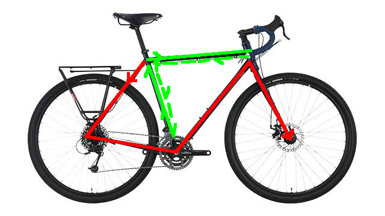

# Bike LEDs

Hello there. Wanna have awesome lights on your bike?

## General info

This project uses 3x 6ft LED strips of 60 LEDs each, an on/off button, 4 potentiometers and a microphone.

The LED strips are taped around the bike like this:

- One strip is on the bottom *right* side of the bike (red)
- One strip is wraped around the *center* top center part of the bike (green)
- One strip is on the bottom *left* side of the bike (not shown)

These side names will be seen across the code. The colors will be mentioned in the project description below.

The potentiometers are:

- Mode selection
- Param 1
- Param 2
- Brightness

Param 1 and 2 are options that can be used differently by each effect.

## Projects

### bike-leds-identical

This project shows a similar effect on all the LED strips you see on one side of the bike. For example if a VU meter effect is shown and you're on the right side of the bike, the red strip will show the full effect, and the green strip will show the effect scaled down 50% and starting from the bottom of the bar right below the saddle.

This project is not updated anymore.

### bike-leds-shared

This project shows the effects as if the bike had only one strip. It calculates coordinates to determine which LEDs should be lit at any given time. For example if a VU meter is shown, the effect will start at the left most LEDs of the red strip, will "grow" on both bottom and top of the strip until it reaches the green strip, will continue to grow right on both the green and red strips, and will finish its "growth" on the right most LEDs of the red strip.

The vertical bar below the saddle (green) is filled with colors that are read from the LEDs on the very left side of the red strip. Note that it grows from its center towards the top and bottom.

### noise-display

This project shows the exact same thing on the three LED strips. It shows the raw output of the microphone at any given time, which allows you to calculate the noise of the microphone when there is no sound around.

If, for example, when it's silent 6 LEDs show up, your noise is `6 / 60 * 255 = 25.50`. I recommend taking the maximum value of the noise that you see as noise value.
